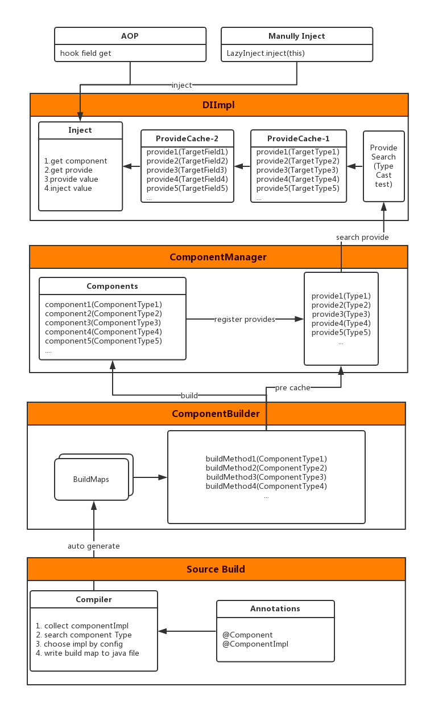

# 1. 动机
## Dagger
1. 较为繁琐，新增一个注入容器需要写好几个类并且需要手动 build
2. 需要主动注入
## 目标
1. 简化，效率增加
2. 实现被动注入，懒加载
3. 类 Spring
4. 实时更新
# 2. Structure

# 3. Key Points
## delegate field
使用 AspectJ 拦截 Field get 操作  
此操作在编译时完成，通过处理 .class 在 Filed get 前插桩，类似 inline hook  
```java
@Aspect
public class InjectAspect {
    @Pointcut("get(* *) && @annotation(inject)")
    public void pointcutInject(Inject inject) {
    }
    @Around("pointcutInject(inject)")
    public Object aroundFieldGet(ProceedingJoinPoint joinPoint, Inject inject) throws Throwable {
        Object targetObj = joinPoint.getTarget();
        Field field = ReflectUtils.getField(joinPoint, Inject.class);
        if (field == null)
            return joinPoint.proceed();
        if (!field.isAccessible()) {
            field.setAccessible(true);
        }
        Object res = null;
        if (!inject.alwaysRefresh()) {
            if (field.get(targetObj) != null)
                return joinPoint.proceed();
            res = getValue(inject.component(), field, inject.args());
            if (res == null) {
                if (inject.nullProtect()) {
                    res = InterfaceProxy.make(field.getType());
                }
                return res;
            }
            field.set(targetObj, res);
        } else {
            res = getValue(inject.component(), field, inject.args());
            if (res == null) {
                if (inject.nullProtect()) {
                    res = InterfaceProxy.make(field.getType());
                }
                return res;
            }
            field.set(targetObj, res);
        }
        return res;
    }
    private final static Object getValue(Class type, Field field, String[] args) {
        Object res = null;
        Class component = getComponentType(type, field);
        if (component == null)
            return null;
        if (ValidateUtil.isEmpty(args))
            res = ComponentManager.providerValue(component, field, null);
        else
            res = ComponentManager.providerValue(component, field, null, (Object[]) args);
        return res;
    }
    private final static Class getComponentType(Class type, Field field) {
        Class component = type;
        if (component == Inject.None.class) {
            component = field.getType().getEnclosingClass();
            if (component == null || component == Object.class)
                return null;
        }
        return component;
    }
}
```
## Get Target Field
由于混淆会破坏某些切面生成的代码，混淆后 Runtime 正常方法可能拿不到 Field，所幸 StaticPart 中的信息 SourceLocation().getWithinType() 保存的是 class 类型而非 String
## Search Provide
通过对比容器中 Provide 的类型和 Field 所需要的类型来定位目标 Provide  
需要递归对比 Type 类型  
```java
public final static boolean canCast(Type inter, Type impl) {

        if (inter.equals(impl))
            return true;

        if (inter instanceof Class && impl instanceof Class) {
            return ((Class) inter).isAssignableFrom((Class<?>) impl);
        }

        if (impl instanceof WildcardType) {
            Type[] type = ((WildcardType) impl).getUpperBounds();
            if (ValidateUtil.isEmpty(type))
                return canCast(inter, Object.class);
            for (Type t : type) {
                if (canCast(inter, t)) {
                    return true;
                }
            }
            return false;
        }

        if (inter instanceof WildcardType) {
            Type[] upperBounds = ((WildcardType) inter).getUpperBounds();
            Type[] lowerBounds = ((WildcardType) inter).getLowerBounds();
            if (!ValidateUtil.isEmpty(lowerBounds)) {
                for (Type t : lowerBounds) {
                    if (!canCast(t, impl)) {
                        return false;
                    }
                }
                return true;
            } else if (!ValidateUtil.isEmpty(upperBounds)) {
                for (Type t : upperBounds) {
                    if (!canCast(t, impl)) {
                        return false;
                    }
                }
                return true;
            } else {
                return canCast(Object.class, impl);
            }
        }

        if (impl instanceof TypeVariable) {
            Type[] type = ((TypeVariable) impl).getBounds();
            if (ValidateUtil.isEmpty(type))
                return canCast(inter, Object.class);
            for (Type t : type) {
                if (canCast(inter, t)) {
                    return true;
                }
            }
            return false;
        }

        if (inter instanceof TypeVariable) {
            Type[] type = ((TypeVariable) inter).getBounds();
            if (ValidateUtil.isEmpty(type))
                return canCast(Object.class, impl);
            for (Type t : type) {
                if (!canCast(t, impl)) {
                    return false;
                }
            }
            return true;
        }

        if (inter instanceof ParameterizedType) {
            Type[] interTypes = ((ParameterizedType) inter).getActualTypeArguments();
            if (impl instanceof Class) {
                if (canCast(getRawType(inter), impl)) {
                    return isObjectType(interTypes);
                } else {
                    return false;
                }
            } else if (impl instanceof ParameterizedType) {
                if (canCast(getRawType(inter), getRawType(impl))) {
                    Type[] implTypes = ((ParameterizedType) impl).getActualTypeArguments();
                    if (implTypes == null || interTypes == null || interTypes.length != implTypes.length)
                        return false;
                    for (int i = 0; i < interTypes.length; i++) {
                        if (!canCast(interTypes[i], implTypes[i])) {
                            return false;
                        }
                    }
                    return true;
                } else {
                    return false;
                }
            } else {
                return false;
            }
        } else if (inter instanceof Class) {
            if (impl instanceof ParameterizedType) {
                if (canCast(inter, getRawType(impl))) {
                    Type[] implTypes = ((ParameterizedType) impl).getActualTypeArguments();
                    return isObjectType(implTypes);
                } else {
                    return false;
                }
            } else {
                return false;
            }
        } else if (inter instanceof GenericArrayType) {
            if (impl instanceof GenericArrayType) {
                return canCast(((GenericArrayType) inter).getGenericComponentType(), ((GenericArrayType) impl).getGenericComponentType());
            } else {
                return false;
            }
        } else {
            return false;
        }
    }
```
## Auto Generate Build Map
Annotation Processor  
根据 ComponentImpl 确定 Component Type
```java
 public TypeElement doGetComponentType(TypeElement implType) {
        if (implType.getAnnotation(Component.class) != null)
            return implType;
        TypeMirror superclassMirror = implType.getSuperclass();
        if (superclassMirror != null) {
            TypeElement superType = (TypeElement) types.asElement(superclassMirror);
            if (superType != null && !"java.lang.Object".equals(superType.getQualifiedName().toString())) {
                TypeElement componentType = doGetComponentType(superType);
                if (componentType != null)
                    return componentType;
            }
        }
        List<? extends TypeMirror> interfacesMirrors = implType.getInterfaces();
        if (interfacesMirrors != null) {
            for (TypeMirror mirror : interfacesMirrors) {
                TypeElement typeElement = (TypeElement) types.asElement(mirror);
                if (typeElement == null || "java.lang.Object".equals(typeElement.getQualifiedName().toString()))
                    continue;
                TypeElement componentType = getComponentTypeByInterface(typeElement);
                if (componentType != null)
                    return componentType;
            }
        }
        return null;
    }

    private TypeElement getComponentTypeByInterface(TypeElement implType) {
        if (implType.getAnnotation(Component.class) != null) {
            return implType;
        } else {
            List<? extends TypeMirror> interfacesMirrors = implType.getInterfaces();
            if (interfacesMirrors != null) {
                for (TypeMirror mirror:interfacesMirrors) {
                    TypeElement typeElement = (TypeElement) types.asElement(mirror);
                    if (typeElement == null)
                        continue;
                    return getComponentTypeByInterface(typeElement);
                }
            }
            return null;
        }
    }
```